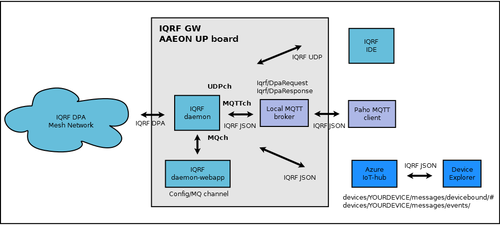

# IQRF(A) Gateways


# Hands-on Workshop



## Setup IQRF sensors and actuators

- Download IQRF Startup [package](http://www.iqrf.org/support/how-to-start)

- Install IQRF IDE software that is included in the package

- Upload DPA plugins, custom handlers and configurations

- Use IDE macros for IoT Starter Kit to test your IQRF mesh network

## Install Linux

- UbiLinux

- Ubuntu 

- Yocto

## Connect IQRF module 

- [Connect](http://www.iqrf.org/weben/downloads.php?id=412) IQRF SPI board to the UP board extension connector

- Plug-in already prepared IQRF coordinator to IQRF SPI board 

## Install IQRF daemon

- Download [Putty](http://www.chiark.greenend.org.uk/~sgtatham/putty/download.html) and connect to your UP board via SSH (192.168.13.x)

- Download public key to verify the packages from the repository

```bash
sudo apt-key adv --keyserver keyserver.ubuntu.com --recv-keys 66CB9A85
```

- Add repository to the source list

```bash
echo "deb http://repos.iqrfsdk.org/debian jessie testing" | sudo tee -a /etc/apt/sources.list
sudo apt-get update
```

- Install the daemon

```bash
sudo apt-get install iqrf-daemon
```

## Configure IQRF daemon by [iqrf-daemon-webapp](https://github.com/iqrfsdk/iqrf-daemon-webapp) 

- Use your browser 

http://192.168.13.x (admin/iqrf)

- Restart the iqrf-daemon service

```bash
sudo systemctl restart iqrf-daemon.service
```
*or you can use iqrf-daemon-webapp*

## Install MQTT mosquitto broker

```bash
sudo apt-get update
sudo apt-get install mosquitto
```

## Test MQTT channel

- Download MQTT Paho [client](http://repo.eclipse.org/content/repositories/paho-releases/org/eclipse/paho/org.eclipse.paho.ui.app/1.0.0/org.eclipse.paho.ui.app-1.0.0-win32.win32.x86.zip) for Win/Linux

- Connect Paho client to your Mosquitto broker on the UP (192.168.13.x)

- Use prepared JSON [examples](json-messages) to communicate with IQRF sensors and actuators

## Test UDP channel

- Switch the daemon to **Service** mode by prepared JSON [examples](json-messages/5-conf-mode) 

- Connect IQRF IDE to the UP board via UDP

- Run IQMesh Network Manager to control your IQRF network

- Switch the daemon to **Forwarding** mode by prepared JSON [examples](json-messages/5-conf-mode) 

- Switch the daemon back to **Operational** mode by prepared JSON [examples](json-messages/5-conf-mode)

## Test MQ channel

- Use Putty to connect to your UP board via SSH

- Use iqrfapp and prepared [scripts](scripts) to communicate via the daemon to IQRF network
*or you can use iqrf-daemon-webapp*

## Connect to Azure cloud

- Start with dev essentials [program](https://www.visualstudio.com/cs/dev-essentials/) and activate Azure package

- Create iothub in your Azure portal

- Create device in the iothub that will represent IQRF GW - UP board

- Use Device explorer [app](https://github.com/Azure/azure-iot-sdk-csharp/releases) to connect to iothub

- Copy connection string from your Azure portal and put it to the Device Explorer

- Generate SAS token using Device explorer - is used as password in MQTT [config](daemon-config/MqttMessaging.json)

- Update MQTT [config](daemon-config/MqttMessaging.json) in the iqrf-daemon

- Setup [scheduler](daemon-config/Scheduler.json) for regural every 30s readings from DDC-SE

- Restart the daemon

```bash
sudo systemctl restart iqrf-daemon.service
```
- Confirm receiving scheduled DDC-SE readings by Device Explorer [app](https://github.com/Azure/azure-iot-sdk-csharp/releases)
